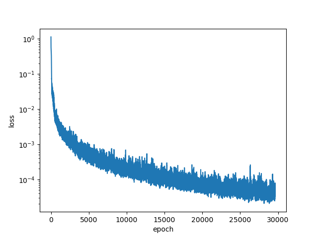
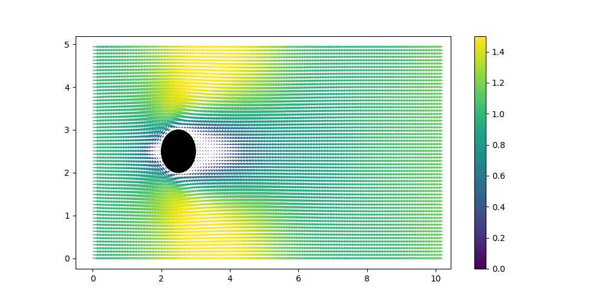
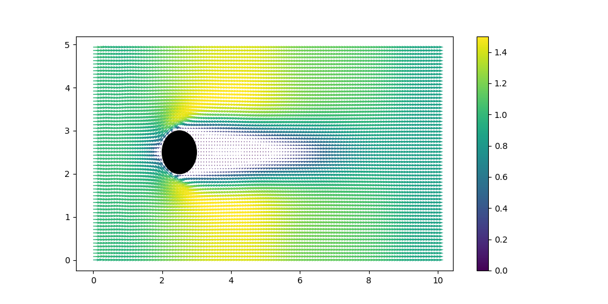
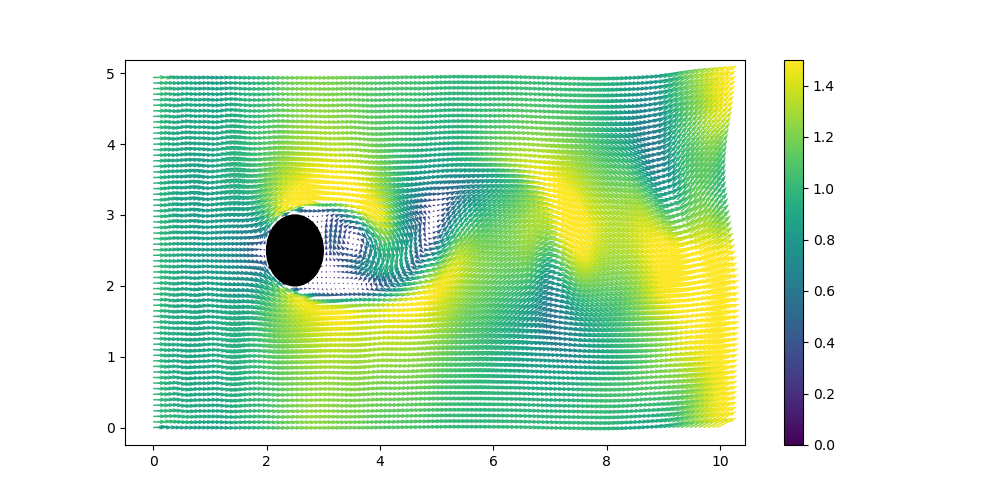

# CylinderWakeAutoEncoder
A simulation of wake behind cylinder. dimensionality reduction by auto encoder

## Introduction

This is a simple simulation of wake behind a cylinder. 
The simulation is done using Lattice Boltzmann Method. ( see `cylinder.cpp` )

The simulation is done for three different Reynolds numbers($Re = 5, 40, 200$). 

The simulation data is then used to train an auto encoder to reduce the dimensionality of the data to 32-sized latent space. ( `autoencoder.py`)

We then defined a neural network to predict time integral `step()` function on the latent space.
Neural network takes 32-sized latent vector **z** and Reynolds number $Re$ as input and predicts the next latent vector **z'**. ( `stepper.py` )

We will see that the neural network is able to predict the next latent vector with untrained Reynolds number.

## Results

### Loss of AutoEncoder

### Loss of LatentStepper

### $Re = 5$

### $Re = 30$

### $Re = 150$

